# Intellij Rime color scheme

Dark editor color scheme with soft cold colors and based on original Darcula scheme.

# Setup

 * Download ```rime.icls``` or ```rime.jar``` file;
 * Open ```Preferences``` window
 * Go to ```Editor -> Color Scheme```;
 * Press gear button and choose ```Import Scheme -> Intellij Idea color scheme (.icls) or settings (.jar)```;
 * Choose file from disk;

# Screenshots

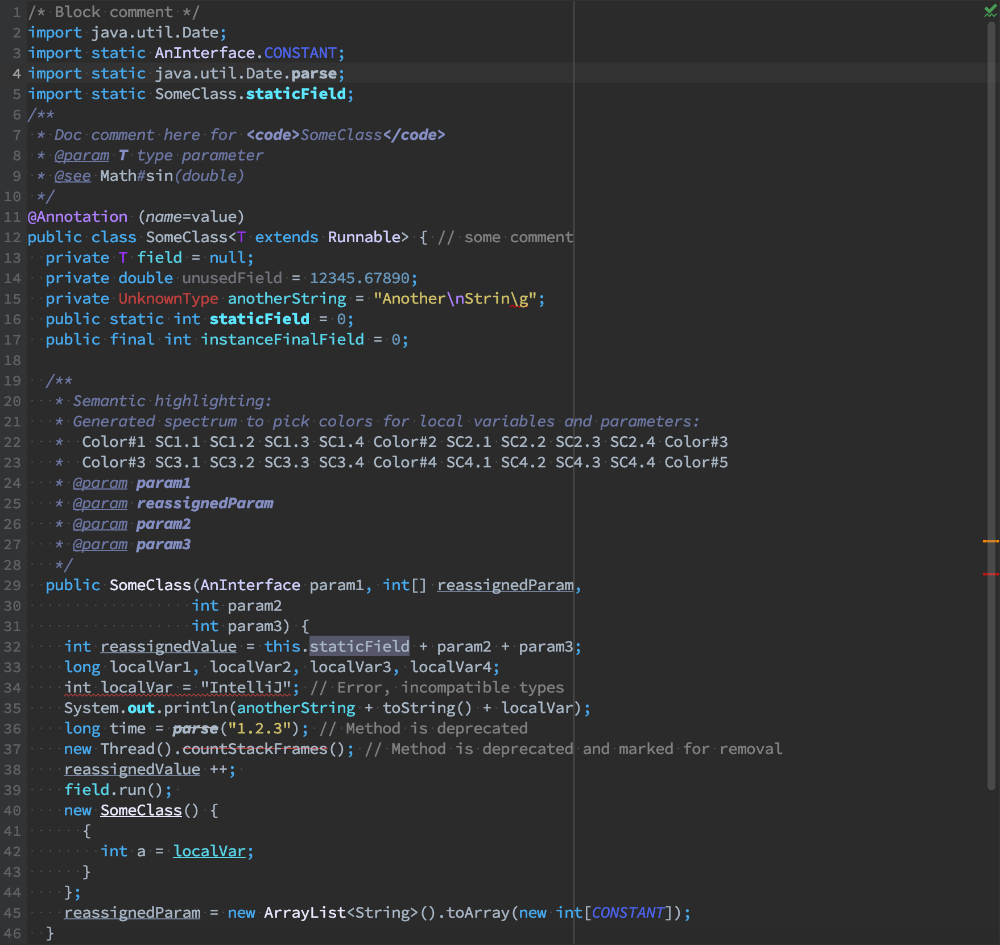
_Java_

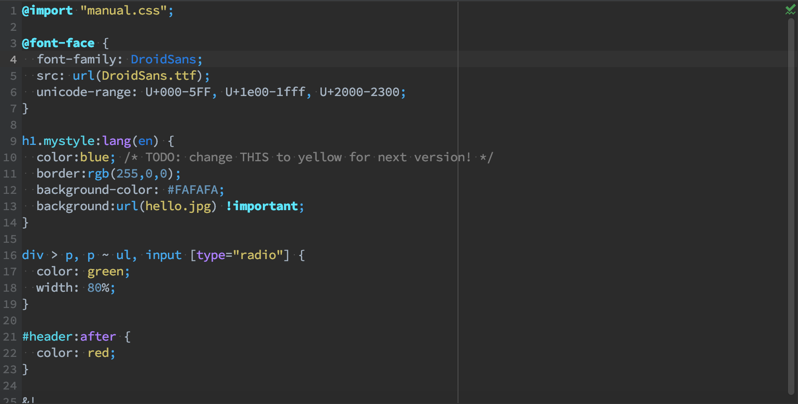
_CSS_

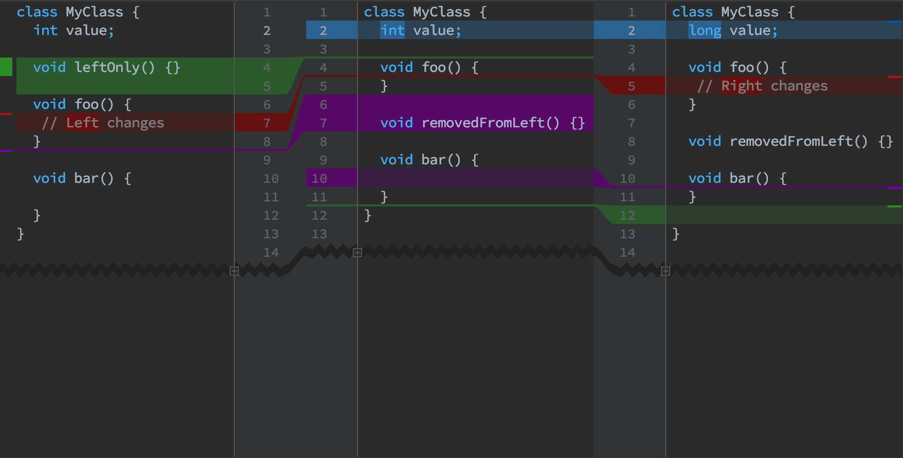
_Diff and merge_

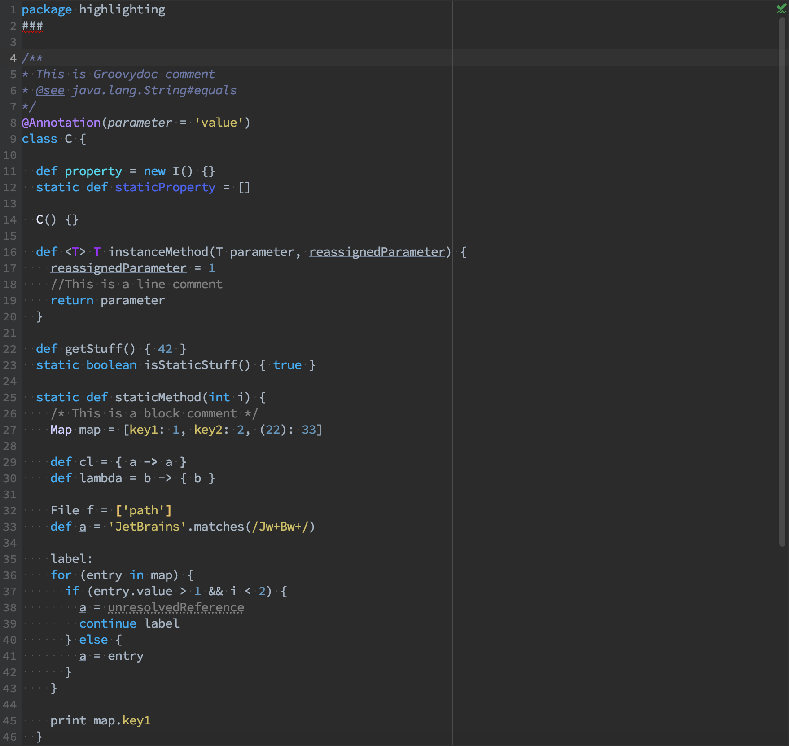
_Groovy_

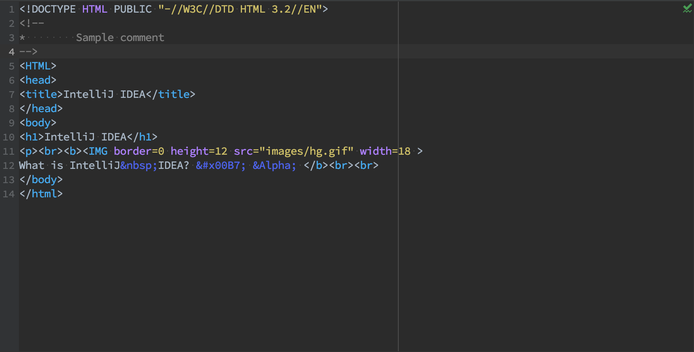
_HTML_

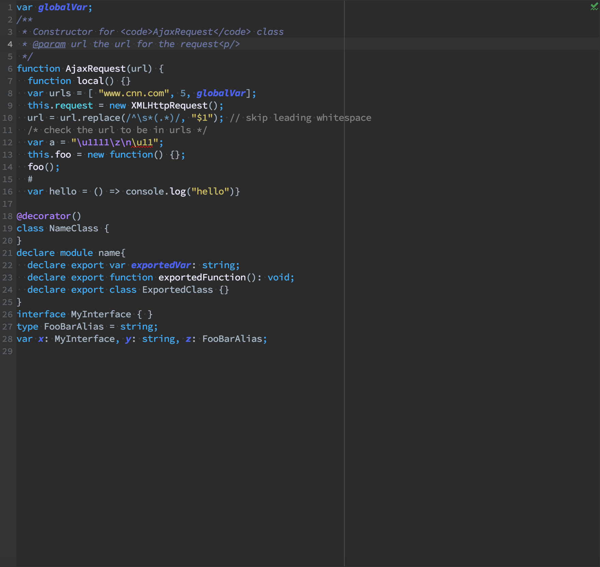
_Javascript_

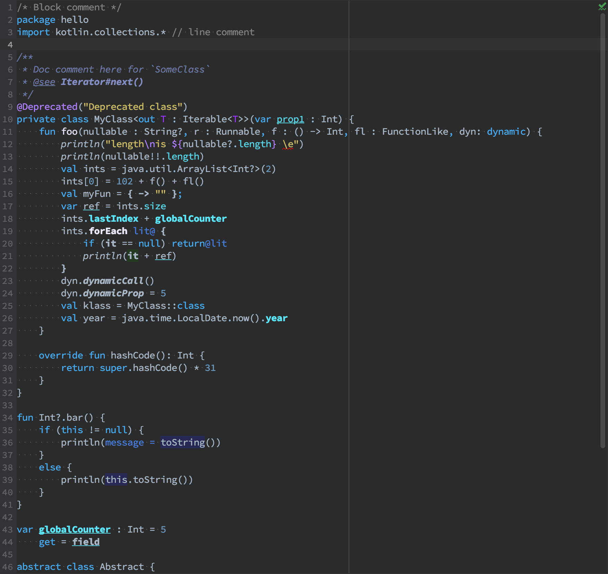
_Kotlin_

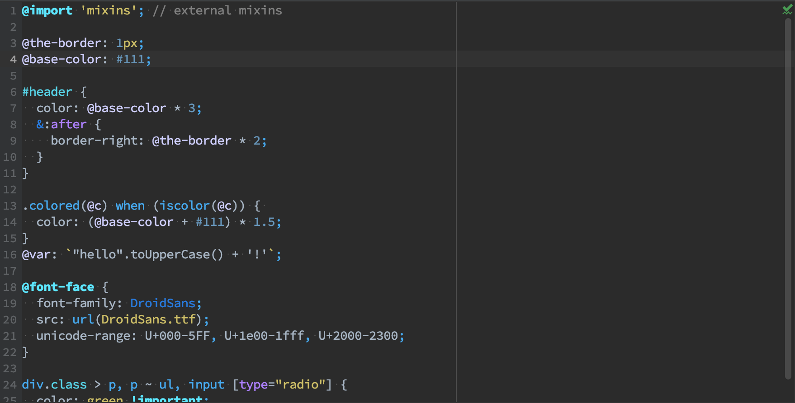
_less_

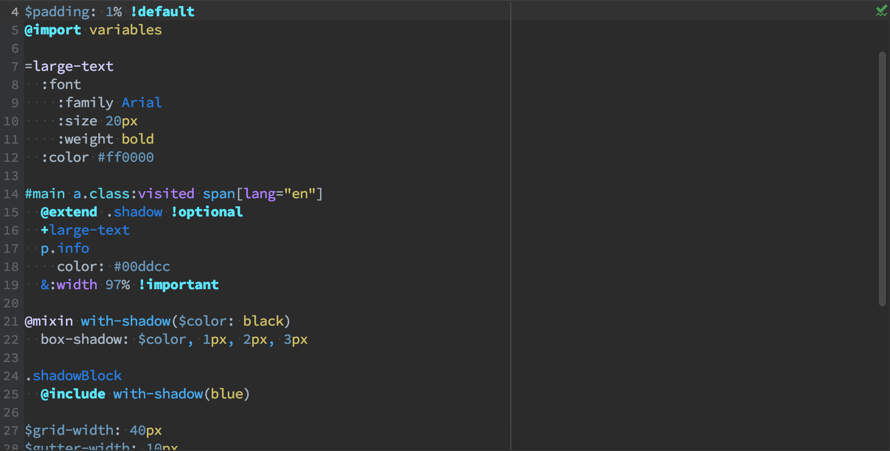
_sass_

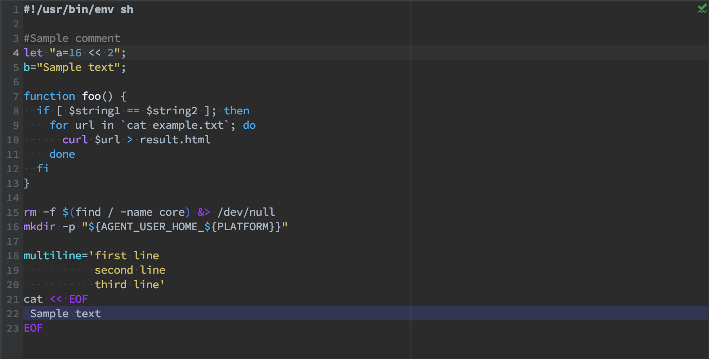
_Shell script_

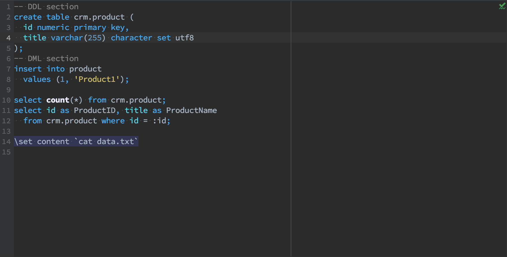
_SQL_

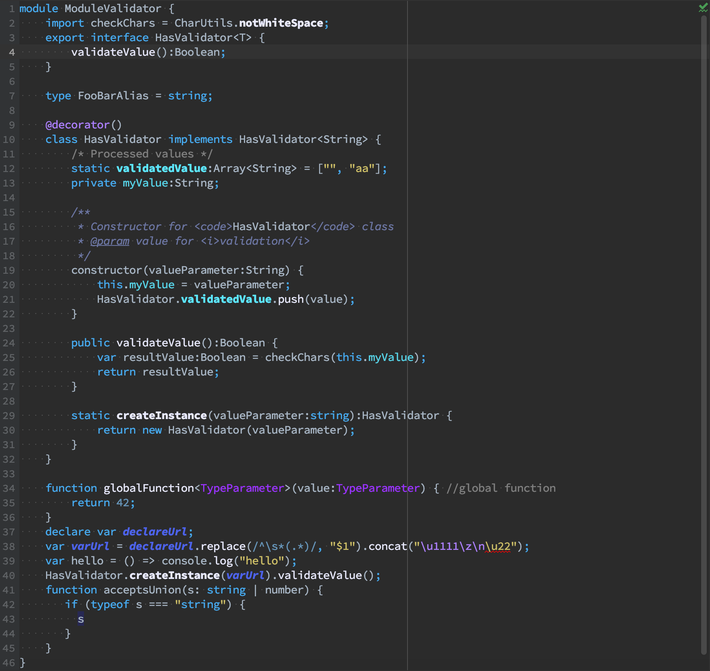
_Typescript_

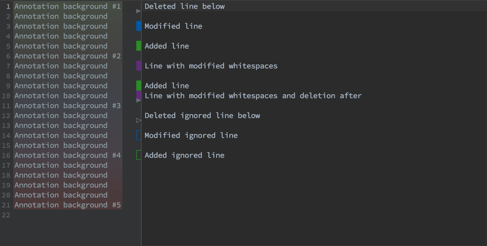
_VCS_

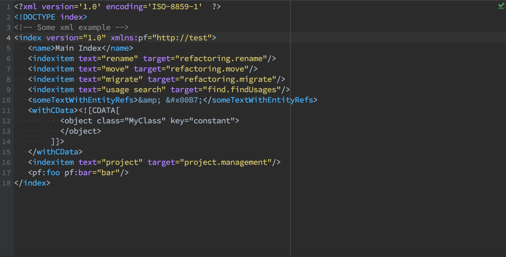
_XML_

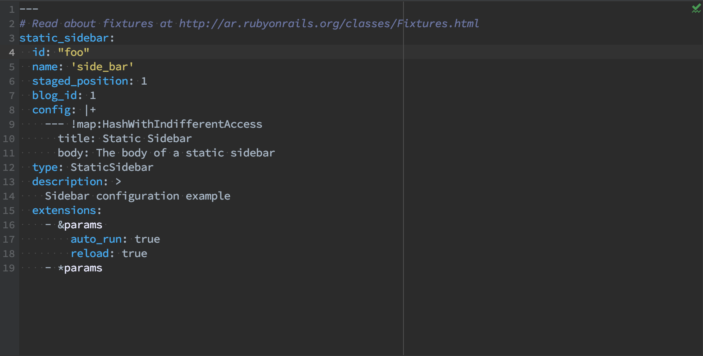
_yml_
